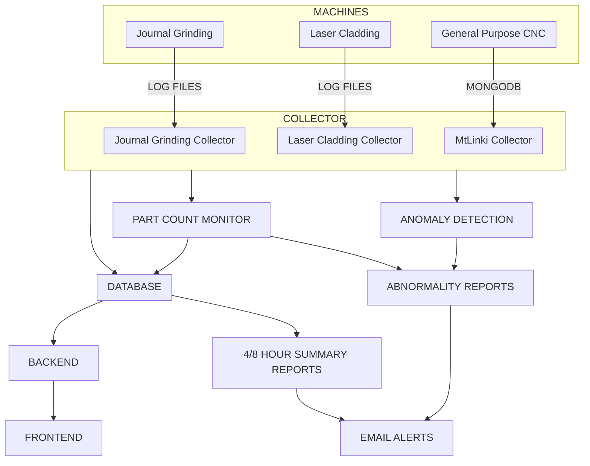
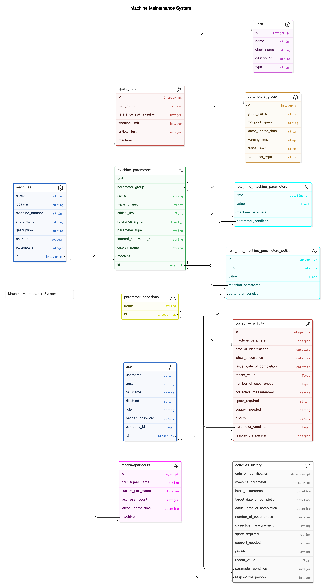

# Technical Stack

## Introduction
Based on the requirements and nature of the current system, the figure below shows the overall architecture of the proposed solution.

## Implementation
All the requried services are developed using python script and deployed as linux daemon services.
There are two plants: TNGA and GDPlant. 
For the TNGA plant, the implementations are given below. The implementation for GDPlant is the same as TNGA, but it does not include SPM machines.

### Collectors

- **MtLinki Collector**
    - **Static Collector** - This service collects all new data from the MtLinki mongodb database for the 16 static parameter group.

    - **Dynamic Collector** - This service collects all new data from the MtLinki mongodb database for the 1 dynamic (servo and spindle load) parameter group.

- **Lasser Cladding Collector** - This service collects data from the laser cladding machine from its log files.

- **Journal Grinding Collector** - This service collects all new data from the journal grinding machine from its log files.

### Anomaly Detection

The anomaly detection for cnc machines are implemeted as part of the collector services.

- **Static Parameters** - The anomaly detection for the 16 parameter groups are part of the static collector service and it works by simply {==checking if the current value of the parameters are within the normal working range==}.

- **Dynamic Parameters** - The anomaly detection for the 1 parameter group (Servo and Spindle load) are part of the dynamic collector service and {==it works using Kruskal–Wallis one-way analysis of variance algorithm==}. This method compares the signal values for a new cycle with a reference signal, for any anomaly.

### Part Count Monitor

The machine part counts (for 59 cnc machines) are monitored from the parameter "para name". Once the reset button on the machine controller is pressed, the part count will be reset to zero. But to get a cumulative part count, we store the last part count value before the reset button was pressed, then whenever the part count is increased, the actual part count would be the part count before the press of reset button plus the current part count value. The formula for that is given below:

$$
\operatorname{} P_{A} = P_{Current} + P_{Cumulative}        ....... 1
$$

Where,
P~A~ --> Actual Part Count

P~Current~ --> Current Part Count

P~Cumulative~ --> Cumulative Part Count Before Press of Reset Button

### Abnormality Reports

Different abnormalities are generated as an excel report as soon as they are recorded, and stored in a common location (Where the email alerts service will be looking for new report), these files will be deleted as soon as they are sent as email alerts by the email alerts services. The following things will create an abnormality report:

- **Static Parameter Abnormality** - This will be recorded by the static collector as soon as {==any parameter goes beyond it's normal working range==}. A sample report is shown below.

- **Dynamic Parameter Abnormality** - This will be recorded by the dynamic collector as soon as {==any set of parameters belonging to a specific cycle is not similar to it's reference signal==}. A sample report is shown below.

- **Part Count Alert** - This will be recorded by the part count monitor as soon as {==any component of a machine exceeded it's part count limit and needs to be replaced==}. A sample report is shown below.

### Database

From the requirements and nature of current system, we've choosen timescale db as the database to store all the data. The entity relationship diargrams of all the table of the database is shown below:

{ align=center }

The details of all the tables are given below:

1. **Machine** - This table will consist of data related to all the machines available at the new plant (including SPM machines). The details of its columns are given below:

     - **id**
         - **Description**: The prime identifier for any row within this table.
         - **Type**: Integer
  
     - **name**
         - **Description**: The name of the machine.
         - **Type**: String
  
     - **location**
         - **Description**: The location of the machine within the plant (crank, block, engine line).
         - **Type**: String
  
     - **machine_number**
         - **Description**: The number of the machine.
         - **Type**: String
  
     - **short_name**
         - **Description**: A short name for the machine.
         - **Type**: String
  
     - **description**
         - **Description**: A short description of the machine.
         - **Type**: String
  
     - **enabled**
         - **Description**: Indicates if the machine is enabled or not.
         - **Type**: Boolean
  
     - **parameters**
         - **Description**: The total number of parameters this machine has.
         - **Type**: Integer

1. **Unit** - This table will consist of data related to all the units of parameters of machines available at the new plant (including SPM machines). The details of its columns are given below:

     - **id**
         - **Description**: The prime identifier for any row within this table.
         - **Type**: Integer
  
     - **name**
         - **Description**: The name of the unit for a machine parameter.
         - **Type**: String
  
     - **short_name**
         - **Description**: A short name for the unit.
         - **Type**: String
  
     - **description**
         - **Description**: A short description of the unit.
         - **Type**: String
  
     - **type**
         - **Description**: To be addressed (TBA).
         - **Type**: String

1. **ParameterGroup** - This table will consist of data related to all the groups of parameters (especially for the 59 CNC machines), such as APC battery, encoder temperature, etc. The details of its columns are given below:

     - **id**
         - **Description**: The prime identifier for any row within this table.
         - **Type**: Integer
  
     - **group_name**
         - **Description**: The name of the parameter group.
         - **Type**: String
  
     - **mongodb_query**
         - **Description**: The regex pattern used to wildcard only the parameter names (as available in the Fanuc MtLinki MongoDB) belonging to the parameter group. Used internally by the collector services to query parameters from different groups.
         - **Type**: String
  
     - **latest_update_time**
         - **Description**: The latest time for which new data was available for the parameter group as a whole.
         - **Type**: Float
  
     - **warning_limit**
         - **Description**: The warning limit (only available for static parameters).
         - **Type**: Integer
    
     - **critical_limit**
         - **Description**: The critical limit (only available for static parameters).
         - **Type**: Integer
  
     - **parameter_type**
         - **Description**: Indicates if the parameter (applicable only for static parameters) is of type increasing or decreasing.
         - **Type**: String

1. **MachineParameter** - This table will consist of data related to all the parameters of machines available at the new plant (including SPM machines). The details of its columns are given below:

     - **id**
         - **Description**: The prime identifier for any row within this table.
         - **Type**: Integer
  
     - **name**
         - **Description**: The name of the machine parameter.
         - **Type**: String
  
     - **machine_id**
         - **Description**: A foreign key referring to the id of Machines table, indicating the machine to which this parameter belongs.
         - **Type**: Integer
    
     - **internal_parameter_name**
         - **Description**: The internal name of the parameter.
         - **Type**: String
  
     - **display_name**
         - **Description**: The display name of the parameter.
         - **Type**: String
  
     - **warning_limit**
         - **Description**: The warning limit (only available for static parameters).
         - **Type**: Float
  
     - **critical_limit**
         - **Description**: The critical limit (only available for static parameters).
         - **Type**: Float
  
     - **reference_signal**
         - **Description**: The reference signal that is considered as a good signal for this parameter (only available for dynamic parameters).
         - **Type**: Array of Float
  
     - **parameter_group_id**
         - **Description**: A foreign key referring to the id column of the ParameterGroup table, representing the parameter group to which this parameter belongs.
         - **Type**: Integer
  
     - **unit**
         - **Description**: A foreign key referring to the id column of the Unit table, representing the unit this parameter has.
         - **Type**: Integer
  
     - **parameter_type**
         - **Description**: Indicates if the parameter (applicable only for static parameters) is of type increasing or decreasing.
         - **Type**: String

1. **User** - This table will consist of data related to all users registered to access the web application. The details of its columns are given below:

     - **id**
         - **Description**: The prime identifier for any row within this table.
         - **Type**: Integer
  
     - **username**
         - **Description**: The username of the user.
         - **Type**: String
  
     - **email**
         - **Description**: The email id of the user.
         - **Type**: String
  
     - **full_name**
         - **Description**: The full name of the user.
         - **Type**: String
  
     - **disabled**
         - **Description**: A boolean variable used to check if the user is enabled or not.
         - **Type**: Boolean
  
     - **hashed_password**
         - **Description**: The hashed password of the user.
         - **Type**: String
  
     - **role**
         - **Description**: The role of the user.
         - **Type**: String
    
     - **company_id**
         - **Description**: The company id the user is associated with.
         - **Type**: Integer

1. **SparePart** - This table will consist of data related to all spare parts of all the machines. The details of its columns are given below:

     - **id**
         - **Description**: The prime identifier for any row within this table.
         - **Type**: Integer
  
     - **part_name**
         - **Description**: The part name.
         - **Type**: String
  
     - **referenc_part_number**
         - **Description**: The reference part number of the spare part.
         - **Type**: String
  
     - **warning_limit**
         - **Description**: The warning part count limit.
         - **Type**: Integer
  
     - **critical_limit**
         - **Description**: The critical part count limit.
         - **Type**: Integer
  
     - **machine_id**
         - **Description**: A foreign key referring to the id of Machines table, indicating the machine to which this spare part belongs.
         - **Type**: Integer

1. **MachinePartCount** - This table will consist of part count data of all the machines. The details of its columns are given below:

     - **id**
         - **Description**: The prime identifier for any row within this table.
         - **Type**: Integer
  
     - **part_signal_name**
         - **Description**: The signal/parameter name which holds the part count for the machine (as stored in the MongoDB).
         - **Type**: String
  
     - **current_part_count**
         - **Description**: The current part count for the machine.
         - **Type**: Integer
    
     - **last_reset_count**
         - **Description**: The part count of the machine just before the reset button was pressed, used to find the cumulative part count.
         - **Type**: Integer
  
     - **machine_id**
         - **Description**: A foreign key referring to the id of Machines table, indicating the machine to which this part count belongs.
         - **Type**: Integer
    
     - **latest_update_time**
         - **Description**: The most recent timestamp during which the part count was updated (as stored in the MongoDB).
         - **Type**: Datetime

1. **ParameterCondition** - This table will consist of data related to all conditions of a parameter, such as OK, warning, and critical. The details of its columns are given below:

     - **id**
         - **Description**: The prime identifier for any row within this table.
         - **Type**: Integer
    
     - **name**
         - **Description**: The condition name.
         - **Type**: String

1. **Real_Time_Machine_Parameters** - This table will consist of real-time data related to all machines. The details of its columns are given below:

     - **time**
         - **Description**: The timestamp of the real-time data.
         - **Type**: Datetime
    
     - **value**
         - **Description**: The value of the parameter.
         - **Type**: Float
    
     - **parameter_condition_id**
         - **Description**: A foreign key referring to the id of ParameterCondition table, indicating the condition to which this real-time machine parameter value belongs.
         - **Type**: Integer
  
     - **machine_parameter_id**
         - **Description**: A foreign key referring to the id of MachineParameter table, indicating the machine parameter to which this record of value belongs.
         - **Type**: Integer

1. **Real_Time_Machine_Parameters_Active** - This table will consist of the most recent data related to all machines. The details of its columns are given below:

     - **id**
         - **Description**: The prime identifier for any row within this table.
         - **Type**: Integer
    
     - **time**
         - **Description**: The timestamp of the real-time data.
         - **Type**: Datetime
    
     - **value**
         - **Description**: The value of the parameter.
         - **Type**: Float
  
     - **parameter_condition_id**
         - **Description**: A foreign key referring to the id of ParameterCondition table, indicating the condition to which this real-time machine parameter value belongs.
         - **Type**: Integer
  
     - **machine_parameter_id**
         - **Description**: A foreign key referring to the id of MachineParameter table, indicating the machine parameter to which this record of value belongs.
         - **Type**: Integer

1. **Corrective_Activity** - This table contains data related to corrective activities for machine parameters.

     - **id**
         - **Description**: The prime identifier for any row within this table.
         - **Type**: Integer
  
     - **machine_parameter**
         - **Description**: A foreign key referring to the id of MachineParameter table.
         - **Type**: Integer
  
     - **date_of_identification**
         - **Description**: The date when the issue was identified.
         - **Type**: Datetime
  
     - **latest_occurrence**
         - **Description**: The date of the latest occurrence of the issue.
         - **Type**: Datetime
  
     - **target_date_of_completion**
         - **Description**: The target date to complete the corrective action.
         - **Type**: Datetime
  
     - **recent_value**
         - **Description**: The most recent value of the parameter.
         - **Type**: Float
    
     - **number_of_occurrences**
         - **Description**: The number of times the issue has occurred.
         - **Type**: Integer
  
     - **corrective_measurement**
         - **Description**: A description of the corrective measures taken in response to an identified issue or problem.
         - **Type**: String
  
     - **spare_required**
         - **Description**: The spare parts required as part of the corrective action process.
         - **Type**: String
    
     - **support_needed**
         - **Description**: The type of support or assistance required to address an issue or implement corrective measures effectively.
         - **Type**: String
  
     - **priority**
         - **Description**: The priority level of the corrective action.
         - **Type**: String
  
     - **parameter_condition**
         - **Description**: A foreign key referring to the id of ParameterCondition table.
         - **Type**: Integer
    
     - **responsible_person**
         - **Description**: A foreign key referring to the id of User table.
         - **Type**: Integer

1. **Activities_History** - This table contains historical data related to corrective activities for machine parameters.

     - **date_of_identification**
         - **Description**: The date when the issue was identified.
         - **Type**: Datetime
    
     - **machine_parameter**
         - **Description**: A foreign key referring to the id of MachineParameter table.
         - **Type**: Integer
    
     - **latest_occurrence**
         - **Description**: The date of the latest occurrence of the issue.
         - **Type**: Datetime
  
     - **target_date_of_completion**
         - **Description**: The target date to complete the corrective action.
         - **Type**: Datetime
  
     - **actual_date_of_completion**
         - **Description**: The actual date when the corrective action was completed.
         - **Type**: Datetime
  
     - **number_of_occurrences**
         - **Description**: The number of times the issue has occurred.
         - **Type**: Integer
    
     - **corrective_measurement**
         - **Description**: A description of the corrective measures taken in response to an identified issue or problem.
         - **Type**: String
    
     - **spare_required**
         - **Description**: The spare parts required as part of the corrective action process.
         - **Type**: String
  
     - **support_needed**
         - **Description**: The type of support or assistance required to address an issue or implement corrective measures effectively.
         - **Type**: String
  
     - **recent_value**
         - **Description**: The most recent value of the parameter.
         - **Type**: Float
  
     - **parameter_condition**
         - **Description**: A foreign key referring to the id of ParameterCondition table.
         - **Type**: Integer
    
     - **responsible_person**
         - **Description**: A foreign key referring to the id of User table.
         - **Type**: Integer

    
    !!! note

        This is the main table where the recent most value of parameters are stored by all the collector services, for all machines, such as cnc machines, laser cladding, journal grinding. This separate table allows us to optimize the performance while querying the recent most details about all machines, parameter groups, etc.

### Back End

The back end is developed with python and fastapi framework, and ponyorm. The structure of the backend and description of the files and folders are explained in detail in the *Code Explanation* section.

### Front End

The front end is developed with html, css, javascript and react framework. The structure of the frontend and description of the files and folders are explained in detail in the *Code Explanation* section.