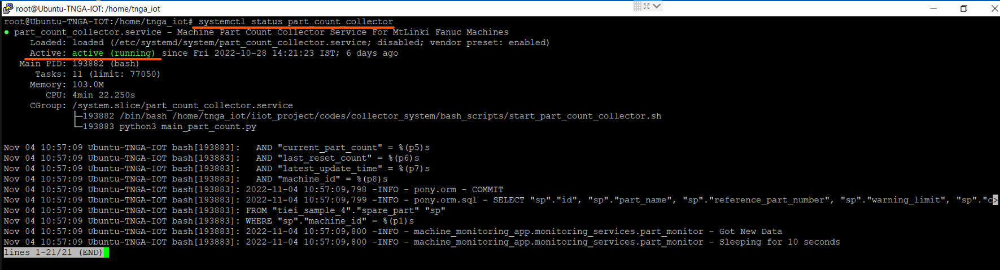
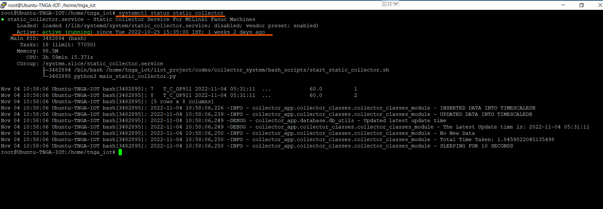

# Troubleshooting & FAQ

## Introduction

This section shows some of the common problems that you might face, and how to quickly solve them.


## How to restart services (and check it status)??

### Check the Status

The following code can be used to check the status of any service

``` cmd

systemctl status static_collector

```

You could replace the *static_collector* with the service you want to check.

The following images shows the result of using that command

{ align=center }

{ align=center }

You shall press *ctrl + c* to get back your terminal from the service status (if required).
### Restart the Service

The following code can be used to restart any service

``` cmd

systemctl restart static_collector

```

You could replace the *static_collector* with the service you want to restart.


!!! tip

    Once in a while you can check the status of all services, or if in case there is any issue you can check all the services and try restarting any service that is inactive/dead. If nothing else works, you can always contact CMTI, We're happy to help! 😃 🤝🏻