# User Interface

This section gives the details about the user interface for the implemented solution. It gives details about all the functionalities of available features and steps to carry out certain tasks.

## Maintenance Section

There are two plants in total: TNGA and GD plant. The user interface remains the same for both plants, but the only difference is that the SPM section and the spare part count sections are not there in the GD plant.

There are two sections within the maintenance section:

- A section to show the states of all parameter groups, production line, machine, and its parameters.

- A section that shows the real-time data (time vs. axis/parameter). This can be accessed by clicking on the axis (tiny rectangular box within the machine information card).

### Machine State Page

The screens that show the states of different elements are shown below.

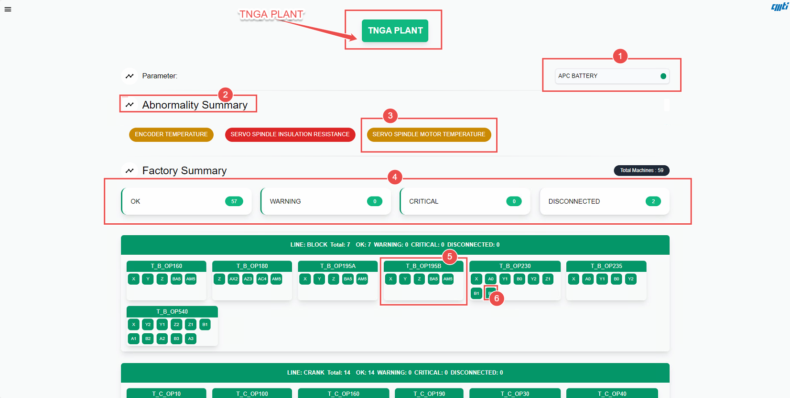{ align=center }
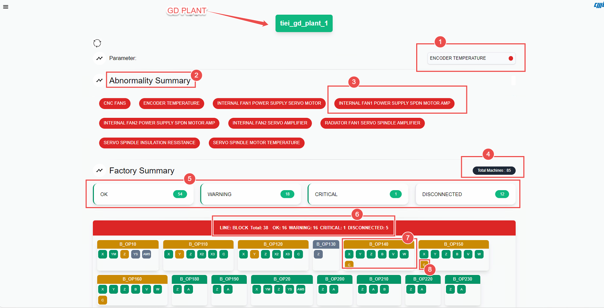{ align=center }

This section shows the machine state of the general-purpose CNC machines. The main element on the screen is your information card for the machines (rectangular box). It has two sets of attributes:

- **Machine Name** - This represents the full name of the machine, such as OP180A (without the production line name).

- **Parameter/Axis Name** - The different axes are represented by the smaller rectangular box within the information card right below the machine name; they typically consist of 1, 2, or 3 letter symbols.

Each of the machines is grouped based on the production line such as head, crank, and block.

This screen shows four types of states:

- **Machine Level State** - Each of the machines (as represented by the rectangular information box) will change its color based upon the current state of all the parameters/axes it has.

- **Axis Level State** - Each of the machine axes (as represented by the smaller rectangular information box) will change its color based upon its current state.

- **Line Level State** - Each of the production lines (as represented by the bigger and transparent rectangular information box) will change its color based upon the current state of all the machines in its production line.

- **Parameter Group Level State** - Each of the parameter groups (as represented by the rectangular information box at the bottom of the page) will change its color based upon the state of the machines in a particular group such as encoder temperature.

For all the above states, red represents a critical state, yellow represents a warning state, and green represents a normal state.

The different sub-sections of this maintenance section are explained below (as numbered in the image above):

1. **Parameter Name**: This shows the parameter group name, such as encoder temperature, APC battery, etc.

1. **Machine State Summary**: This shows the summary of the states of all machines, it gives the total number of machines in the three different states.

1. **Current Section Selected**: This shows the current section (of the web application) that is selected.

1. **Parameter/Axis State**: This shows the current state of the parameter/axis (Critical).

1. **Machine State Information Card**: This shows the current status of the machine.

1. **Line State Information Card**: This shows the name of the production line.

1. **Line State Information Card**: This shows the current state of the production line.

1. **Parameter Group State Summary**: This shows the current state of the different parameter groups that belong to the machine.

### Real Time Graph

The screens that show the real-time data (for static parameter) are shown below

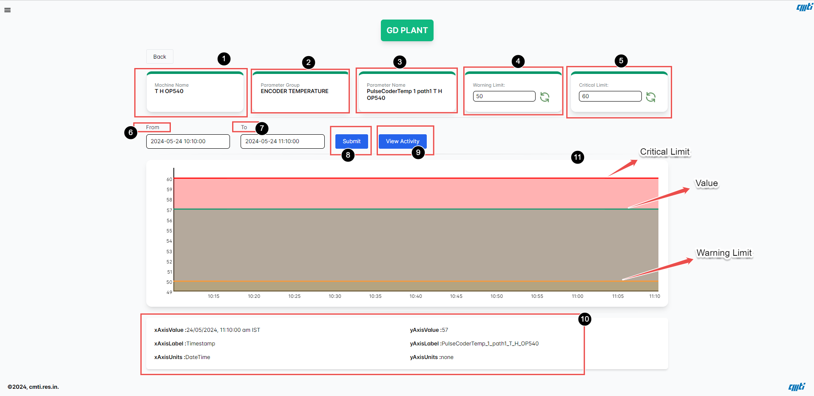{ align=center }

The different sub-sections of this maintenance section are explained below (as numbered in the image above)

1. **Machine Name**: This shows the machine name.

1. **Parameter Group**: This shows the parameter group name.

1. **Parameter Name**: This shows the production line, axis/parameter name.

1. **Warning Limit**: This shows the current warning limit of this parameter. This is the button used to set/change the warning limit for the current parameter.

1. **Critical Limit**: This shows the current critical limit of this parameter. This is the button used to set/change the critical limit for the current parameter.

1. **Start Time Query Selector**: This is used to select the start time of your query to get the real-time data.

1. **End Time Query Selector**: This is used to select the end time of your query to get the real-time data.

1. **Submit Button**: This is the button used to submit your query for real-time data.

1. **View Activity**: For the specific parameter, you can view the recent activity.

1. **Detailed Graph Information Card**: This information card shows the x and y axis names, units, and the current value of x and y axis when you hover the mouse over the graph.

1. **Graph Title**: This shows the title of the graph.

    !!! note

        If data is not available for the given time range, the most recent available data is given. Only in the case where the parameter has no data recorded ever, it will throw a warning.

The screens that shows the real time data (for dynamic parameter) is shown below

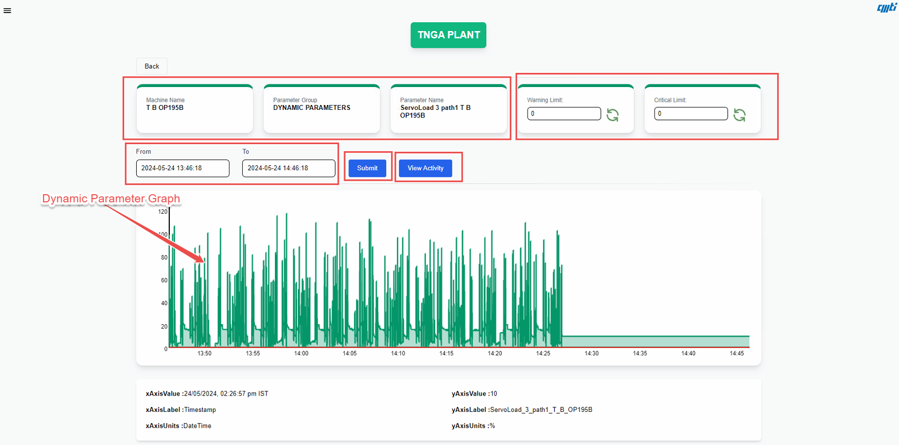{ align=center }

The different sub sections of this maintenace section is explained below (as numbered in the image above)

1. **Add/Edit Limits** : This button is used to add (new or remove and replace existing) or append (to already existing) reference signal to the dynamic parameter.

## Alarm Monitoring Section

There section has one table to give the list of alarms for the selected machine in given time range, and three graphs:

- **Alarm Count Vs Alarms** - This shows a parito graph between the total count of alarms and the alarm (name), for the selected machine and time range.

- **Alarm Timespan Vs Alarms** - This shows a parito graph between the total time (in seconds) of alarms and the alarm (name), for the selected machine and time range.

- **Alarm Timespans** - This shows a pi chart of the different alarms according to their total alarm timespan in seconds.

### Alarm Table

The screens that shows the alarm table is shown below

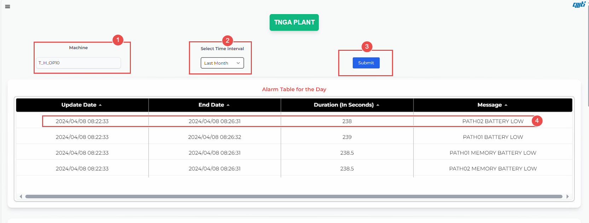{ align=center }

The different sub sections of this section is explained below (as numbered in the image above)

1. **Page Name** : This shows the title of the page (Alarm Monitoring).

1. **Machine Selection** : This drop down box allows you to select the list of available machines

1. **Date Query Type** : This drop down box allows you to select the type of date query, such as last day, week, month or custom range.

1. **Start Time Query Selector** : This is used to select the start time of your query to get the alarm data.

1. **End Time Query Selector** : This is used to select the end time of your query to get the alarm time data.

1. **Query Submit Button** : This is the button used to submit your query for alarm data.

1. **Table Name** : This shows the title of the table.

1. **Pagnation Selector** : This button allows the user to select the number of rows to be displayed in the table and the page number.

### Partio Graphs

The screens that shows the partio graphs for the **Alarm Count Vs Alarms** and **Alarm Timespan Vs Alarms** are shown below

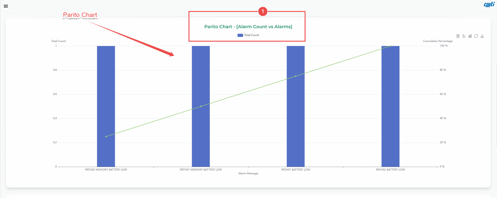{ align=center }

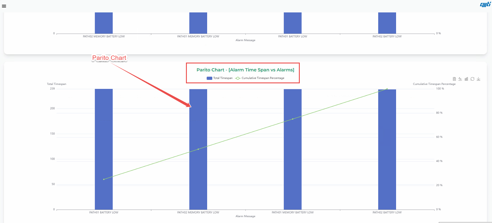{ align=center }

The different sub sections of this section is explained below (as numbered in the image above)

1. **Graph Name** : This shows the title of the graph.

1. **Hide/Reveal Button** : This button is used to hide or reveal the graph.

1. **Legend** : This shows the legend of the graph.

### Pi Chart

The screens that shows the pi chart for the **Alarm Timespan** are shown below:

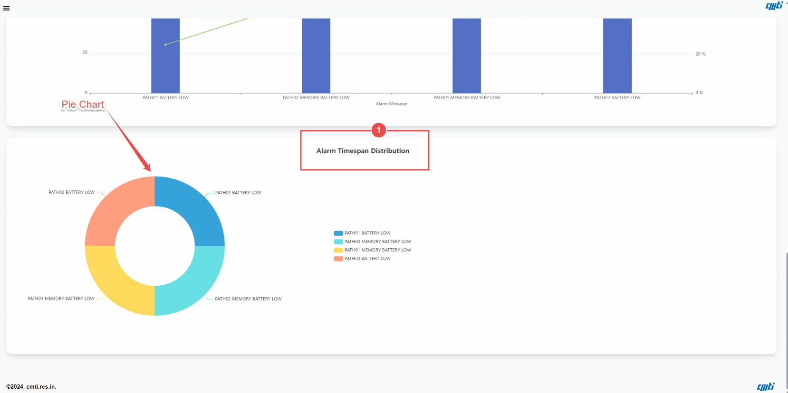{ align=center }

The different sub sections of this section is explained below (as numbered in the image above)

1. **Graph Name** : This shows the title of the graph.

1. **Hide/Reveal Button** : This button is used to hide or reveal the graph.

1. **Legend** : This shows the legend of the graph.

## Spare Part Management

This section is used for spare part management, it has two views:

- **Machine Details** - This shows information card for all available machines and has a details button, which can be clicked to view the current status of it's spare part count.

- **Machine Specific Spare Part Details** - This shows all the available spare parts for the machine, it's current part count and part count of the spare parts.

### All Machine Status

The screens that shows the machine details is shown below

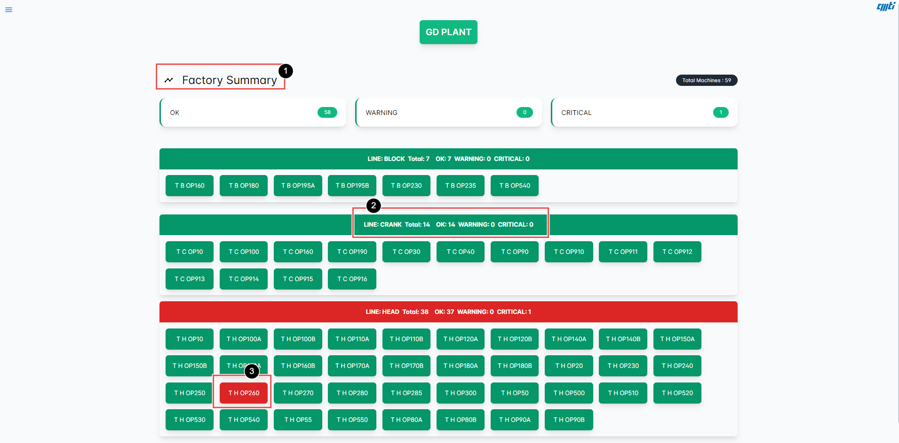{ align=center }

The different sub sections of this section is explained below (as numbered in the image above)

1. **Factory Summary** : This shows Summary the page (Alarm Monitoring).

1. **Production Line Name** : This shows the production line number.

1. **Machine Details** : This shows the details of the machine. The different color represents the state of the machine, where warning / critical means any one or more of the spare parts of the machine has reached the limit and needs to be replaced.

### Machine Specific Spare Part Details

The screens that shows the spare part details for a selected machine is shown below

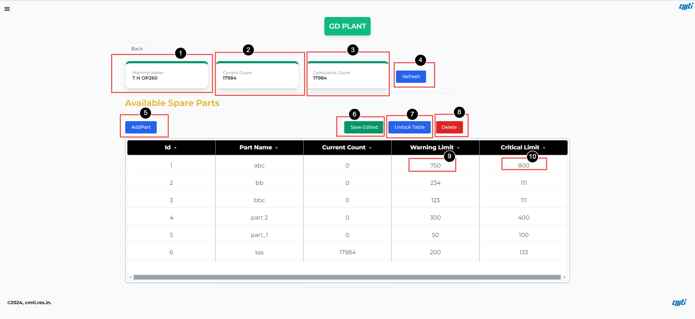{ align=center }

The different sub sections of this section is explained below (as numbered in the image above)

1. **Machine Name** : This shows the prorduction line, machine name.

1. **Cumulative Part Count** : This shows the total/cumulative part count of the machine (irrespective of the number of times the reset button was pressed in the machine).

1. **Current Part Count** : This shows the current part count of the machine after the reset button was pressed.

1. **Lock/Unlock Button** : This button is used to lock and unlock the modification of the spare part, to avoid accidental changes. This has be unlocked before resetting the spare part count.

1. **Add Part Button** : This button is used to create a new spare part for the machine.

1. **Spare Part Warning Limit** : This shows the warning limit for the spare part.

1. **Spare Part Critical Limit** : This shows the critical limit for the spare part.

The screens that shows the spare part details for a selected machine after unlocking the table is shown below

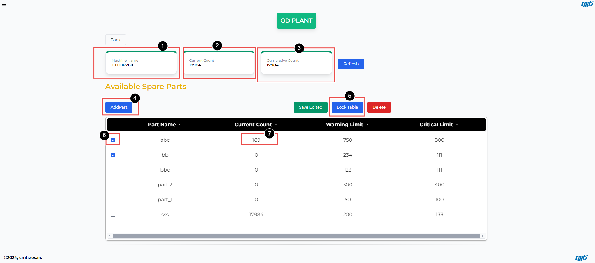{ align=center }

The different sub sections of this section is explained below (as numbered in the image above)

1. **Delete Spare Part Button** : This button is used to delete the spare part from the database.

1. **Current Spare Part Count** : This shows the number of parts produced by the machine (irrespective of the number of time the reset button was pressed, since it take the cumulative value) since the spare part was created in the front end or since the reset button was pressed.

1. **Spare Part Counter Reset Button** : This button is used to reset the spare part count (to zero). This should be used once the part has been replaced in the machine.

1. **Spare Part Warning Limit** : This button can be used to set the warning limit for this spare part (activated only after the table is unlocked).

1. **Spare Part Critical Limit** : This button can be used to set the critical limit for this spare part (activated only after the table is unlocked).

## SPM Machines

This section is used for management of SPM machines, it has two views:

### All SPM Machine Details

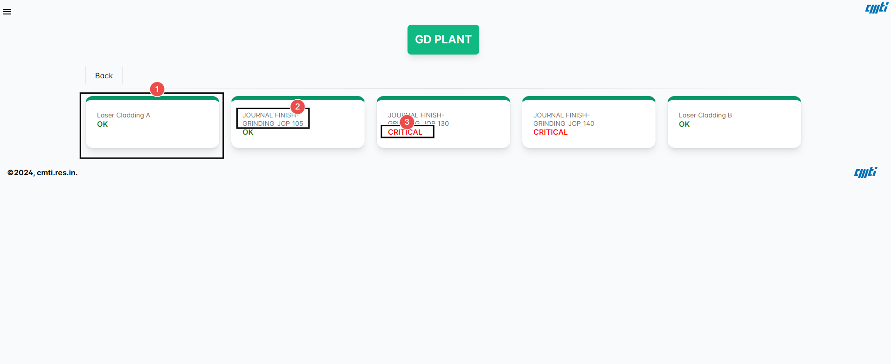{ align=center }

This shows information card for all available SPM machines and has a details button, Where one can view the current status of its parameters as shown in the above image. The information card is highlighted in different colors (green ,orange, red) corresponding to it's (it's parameters) state.The different sub sections of this section is explained below (as numbered in the image above):

1. **Machine Name ** : This shows the machine name.

1. **Parameter Name** : This shows the Parameter name.

1. **Machine Status** :  This shows the machine Status, along with its status (color coded)
### Machine Specific Details

This shows the real time graph for the spm. It can display three information

**Static Parameter** - All the parameters (both static and dynamic) are combined under parameters section, the static parameters will have critical and warning limits. The sample screen is shown below, The different sub sections of this section is explained below (as numbered in the image below).

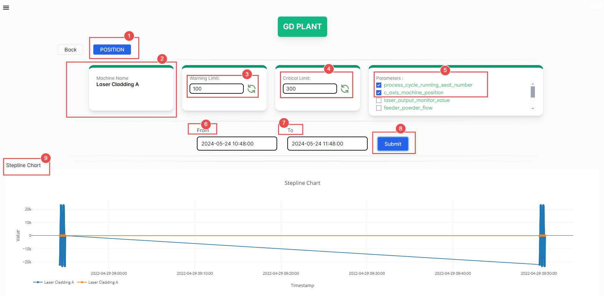{ align=center }

1. **Switch Button ** : This is the switch button between the Postion graph and the Time-Series Graph.

1. **Machine Name** : This shows the machine name.

1. **Limit Setter(Warning)** : This shows the current limits, and also allows the user to set the limits.

1. **Limit Setter (Critical)** : This shows the current limits, and also allows the user to set the limits.

1. **Machine Parameter** : This shows the parameter name, and it's condition (color coded by the box below the parameter name), there is a small check box (to the left of the parameter name) that allows the user to select the parameter that needs to be displayed.

1. **Start Time Query Selector** : This is used to select the start time of your query to get the Postion/Time-series data.

1. **End Time Query Selector** : This is used to select the end time of your query to get the Postion/Time-series data.

1. **Query Submitter** : This shows button is used to submit a real time data query.

1. **Legend** : This shows the legend for the graph, (as the user hovers over the graph, the values will be displayed over here)

**Dynamic Parameter** - All the parameters (both static and dynamic) are combined under parameters section, the dynamic parameters will have button to add edit reference signal. The sample screen is shown below, The different sub sections of this section is explained below (as numbered in the image below)

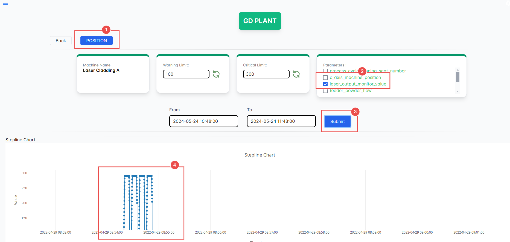{ align=center }

1. **Add/Edit Limits** :  This button is used to add (new or remove and replace existing) or append (to already existing) reference signal to the dynamic parameter.

**Position Based Query** - The sample screen is shown below, The different sub sections of this section is explained below (as numbered in the image below)

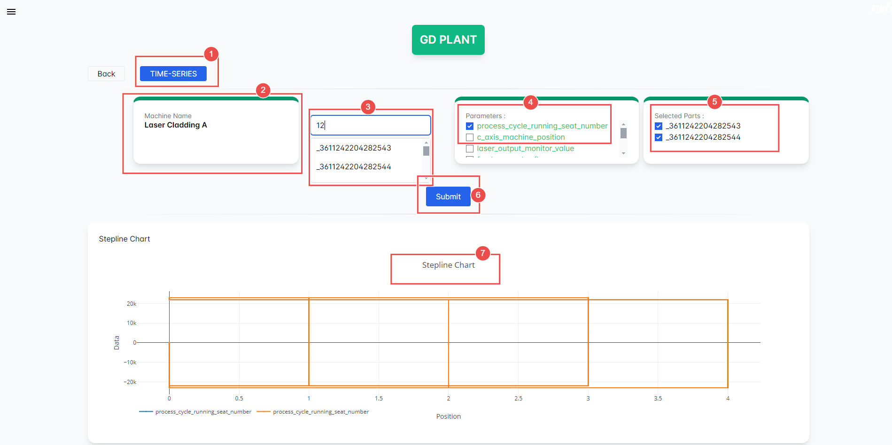{ align=center }

1. **Switch Button ** : This is the switch button between the Postion graph and the Time-Series Graph.

1. **Machine Name** : This shows the machine name.

1. **Part Number Search ** : Here the user can search for the specific part number and select the same for the Graph.

1. **Machine Parameter** : This shows the parameter name, and it's condition (color coded by the box below the parameter name), there is a small check box (to the left of the parameter name) that allows the user to select the parameter that needs to be displayed.

1. **Part Number Selection ** : Here the user can select the specific part number (upto 3 part numbers) and get the Graph for the same.

1. **Start Time Query Selector** : This is used to select the start time of your query to get the Postion/Time-series data.

1. **End Time Query Selector** : This is used to select the end time of your query to get the Postion/Time-series data.

1. **Query Submitter** : This shows button is used to submit a real time data query.

    !!! note

        This screen is applicable only for laser cladding.

## Analytics

This section is used for the management and analysis of various aspects of the machines in the plant. It has three main subsections: Machine Analytics, Maintenance Analytics, and Parameter Analytics. Each subsection allows users to filter data by date and other parameters to generate relevant reports and visualizations.

### Machine Analytics

This subsection allows users to analyze the abnormalities related to specific machines over a selected time period.

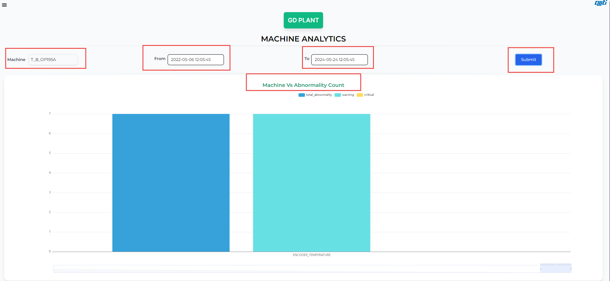{ align=center }

1. **Machine Name**: This input field allows users to specify the machine they want to analyze.
2. **From Date**: Users can set the starting date and time for the analysis period.
3. **To Date**: Users can set the ending date and time for the analysis period.
4. **Submit Button**: After setting the machine name and date range, users click this button to generate the report.
5. **Chart**: The generated chart displays the "Machine Vs Abnormality Count," showing total abnormalities, warnings, and critical issues for the selected machine within the specified date range.

### Maintenance Analytics

This subsection provides insights into the maintenance-related abnormalities managed by different operators over a selected time period.

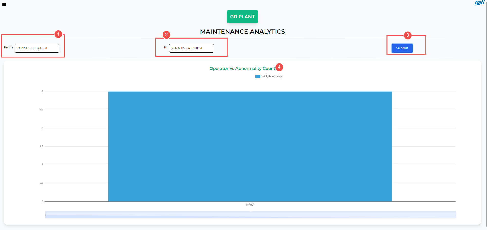{ align=center }

1. **From Date**: Users can set the starting date and time for the analysis period.
2. **To Date**: Users can set the ending date and time for the analysis period.
3. **Submit Button**: After setting the date range, users click this button to generate the report.
4. **Chart**: The generated chart displays the "Operator Vs Abnormality Count," showing the total number of abnormalities managed by different operators within the specified date range.

### Parameter Analytics

This subsection allows users to analyze abnormalities related to specific machine parameters over a selected time period.

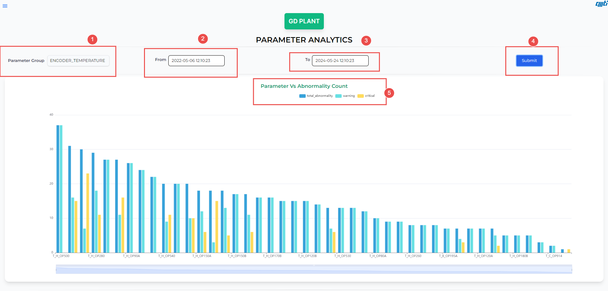{ align=center }

1. **Parameter Group**: This input field allows users to specify the parameter group they want to analyze.
2. **From Date**: Users can set the starting date and time for the analysis period.
3. **To Date**: Users can set the ending date and time for the analysis period.
4. **Submit Button**: After setting the parameter group and date range, users click this button to generate the report.
5. **Chart**: The generated chart displays the "Parameter Vs Abnormality Count," showing total abnormalities, warnings, and critical issues for the selected parameter group within the specified date range.

Each of these subsections provides a detailed visualization of the selected data, helping users to identify trends, issues, and areas needing attention within their plant operations.

## User Management

This section is used for user management:

The screens that shows the user details is shown below

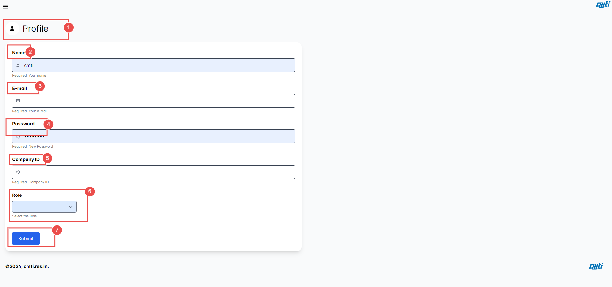{ align=center }

The different sub sections of this section is explained below (as numbered in the image above)

1. **Add User Form** : This is the user registration form used to add new user to the database with his ROLE(Admin, Mantainance , User).

    !!! note

        The admin user "cmti" cannot be deleted, for safety purposes.

